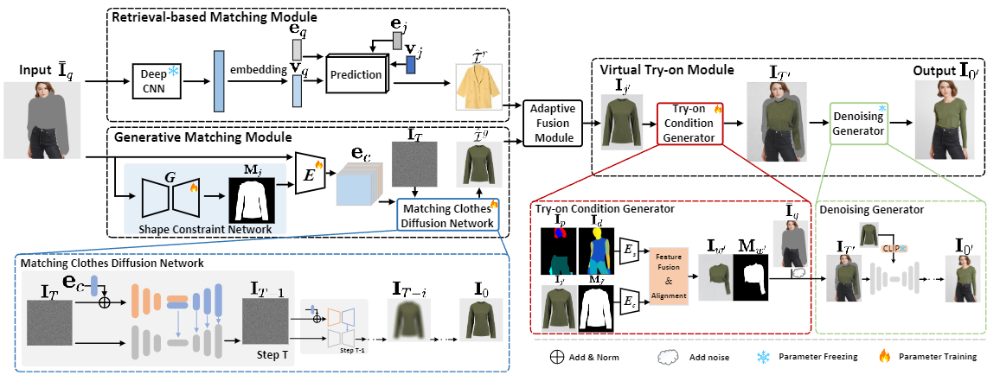

# Smart Fitting Room: A One-stop Framework for Matching-aware Virtual Try-On
This is the implementation of our paper at ICMR 2024:
> [Smart Fitting Room: A One-stop Framework for Matching-aware Virtual Try-On](https://arxiv.org/abs/2401.16825)
> 
> Mingzhe Yu, Yunshan Ma, Lei Wu*, Kai Cheng, Xue Li, Lei Meng, Tat-Seng Chua



## TODO List
- [x] Environment
- [x] Datasets
- [x] Shape Constraint Network
- [x] Matching Clothes Diffusion Network
- [x] Try-on Condition Generator
- [x] Denoising Generator
- [x] Release checkpoint

## Installation
Clone this repository:
```
git clone https://github.com/Yzcreator/HMaVTON.git
cd ./HMaVTON/
```
Install PyTorch and other dependencies:
```
conda env create -f environment.yaml
conda activate control
```
## Datasets
We employ two datasets, POG and VITON-HD, where POG is used as an external dataset for the task of mix-and-match and VITON-HD is directly used for the evaluation of virtual try-on and the overall framework. 
### POG Dataset
We perform n-core filtering on the POG dataset, where we keep only the fashion items that occur between 5 and 100 times, resulting in 119,978 top-bottom pairs, 14,064 tops, and 8,124 bottoms.

You can download the POG dataset txt from https://github.com/wenyuer/POG or download from Dataset/source in our project.

To mitigate the impact of both common and uncommon clothing combinations, we only download outfit sets corresponding to individual clothing items that appear between 5 and 100 times.You can `run Dataset/main.py` to filter and download images via URL to a folder.

You can download the VITON-HD dataset from https://github.com/shadow2496/VITON-HD

## Shape Constraint Network
We implement Shape Constraint Network on the basis of the pix2pix, which takes the human image having partial mask as input, and outputs the mask image of recommended clothes

Handle images in POG and VITON dataset into 512*512 images, and get the training and test training data pairs through 
```
python datasets/combine_A_and_B.py --flod_A /path/to/data/A --flod_B /path/to/data/B --flod_AB /path/to/data
```

## Matching Clothes Diffusion Network
The module is based on a diffusion model guided by conditions, which accepts partially occluded human images and generated shape constraint mask images as conditional constraints, and generates matching outfits. 

We provide a pre-trained model for testing, which learns matching knowledge on the POG dataset and introduces the VITON dataset. You can download the pre-trained model and put it in `checkpoint/`.

## Try-on Condition Generator and Denoising Generator

The module warps the generated garment to fit the distorted garment of the character, adds random Gaussian noise after fitting the garment to the partly-masked character image, and obtains the try-on image by denoising through the diffusion model.


## Checkpoint
The pre-trained model is available at https://drive.google.com/file/d/1gMPs3unpJT0z8HX2xTPnUY_sGDpKLt9x/view?usp=sharing


